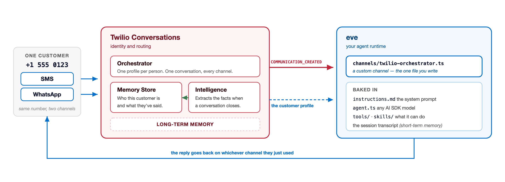

# twilio-conversations-eve-agent

A multi-channel AI agent that unifies **SMS and WhatsApp** into a single conversation and remembers customers across sessions — built with [eve](https://eve.dev) and [Twilio Conversations](https://www.twilio.com/en-us/blog/developers/tutorials/product/orchestrate-multi-call-conversations-with-llm-twilio-conversation-memory).

> **This repo is the companion project to the blog post [TBD — link]**, which walks through every file end-to-end. The README stays minimal on purpose. Read the post for the *why*; read the code for the *how*.

## What it does

- Receives inbound messages on both SMS and WhatsApp through **Twilio Conversation Orchestrator** with `GROUP_BY_PROFILE`, so the same person on both channels lands in **one** conversation.
- Uses **Twilio Memory Store** for long-term per-customer memory. Traits and observations are injected into the model prompt on every session.
- Uses **eve** for the short-term per-conversation transcript, model calls, and durable session state.
- Lets you swap the model in one line via the [AI SDK](https://ai-sdk.dev).

## Architecture



Short-term memory (this conversation) lives in eve. Long-term memory (this customer, across every past conversation) lives in Twilio.

## Repo layout

```
agent/
├── agent.ts                              # model + runtime config
├── instructions.md                       # base system prompt
├── channels/
│   ├── eve.ts                            # local CLI channel (pnpm dev)
│   ├── twilio-orchestrator.ts            # Orchestrator webhook + reply routing
│   └── twilio-builtin.ts.example         # illustrative only — see comments inside
├── instructions/
│   └── customer-context.ts               # injects Memory Store traits/observations
└── lib/
    └── memory.ts                         # Memory Store REST helpers
```

Two files carry the interesting logic: [agent/channels/twilio-orchestrator.ts](agent/channels/twilio-orchestrator.ts) and [agent/lib/memory.ts](agent/lib/memory.ts). The blog post walks through both.

## Why not the built-in `twilioChannel()`?

eve ships a `twilioChannel()` adapter that gets you a working SMS agent in ~10 lines. It's the right starting point for a POC, but it drops MMS media, treats voice as a single `<Gather>` turn, and gives every phone number its own session identity — so SMS and WhatsApp from the same person become two separate customers. See [agent/channels/twilio-builtin.ts.example](agent/channels/twilio-builtin.ts.example) for the full contrast. The blog post explains the tradeoffs.

## Prerequisites

You'll need a handful of things before you start:

- [Node.js](https://nodejs.org/en/download) 24 or newer
- A Twilio account with an **Account SID** and **Auth Token** (find both in the [Twilio Console](https://console.twilio.com))
- At least one SMS-capable Twilio phone number
- A [WhatsApp sender](https://www.twilio.com/docs/whatsapp/self-sign-up) attached to a phone number. It can be the same number you use for SMS, or a second dedicated number. Both work with this setup.
- An OpenAI API key, or your provider of choice ([any AI SDK provider](https://ai-sdk.dev/providers/ai-sdk-providers) works)
- A shell for the provisioning calls. macOS and Linux ship with `curl`. On Windows, every provisioning command in the blog post also has a PowerShell version using `Invoke-RestMethod`, so no extra tooling is needed; if you'd rather run the `curl` versions verbatim, use WSL or Git Bash.
- [ngrok](https://ngrok.com/) or a similar tool for local webhook tunneling. If you haven't used it before, ngrok gives you a public HTTPS URL that forwards to a port on your laptop, so Twilio can reach your webhook while you develop.

## Getting started

```bash
pnpm install
cp .env.example .env    # fill in the values (see below)
pnpm provision          # creates the Memory Store + Orchestrator Configuration
pnpm dev
```

**Fill in `.env` first.** The blog post explains where each value comes from: your Twilio credentials, sender numbers, model key, and `PUBLIC_BASE_URL` (your ngrok URL, which must be running before you provision because it's registered as the Orchestrator webhook).

`pnpm provision` ([scripts/provision.mjs](scripts/provision.mjs)) calls the same Twilio APIs as the curl commands in the blog post. It creates the Memory Store and the Orchestrator Configuration (`GROUP_BY_PROFILE`, SMS + WhatsApp capture rules), waits for both async operations to finish, and writes `MEMORY_STORE_ID` and `ORCHESTRATOR_CONFIG_ID` into `.env`. It's safe to re-run: ids that are already set are reused. If your ngrok URL changes, update the webhook URL on the Configuration in the Twilio Console or create a fresh one.

## License

Apache 2.0 — see [LICENSE](LICENSE).
